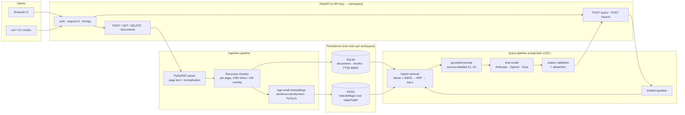

# ContextIQ

**Document-grounded question answering with citations you can check.**

ContextIQ ingests PDFs, indexes them per workspace, and answers natural-language questions with an LLM that is only allowed to cite passages it was actually shown. Every citation in a response maps to a real chunk, filename and page number; if the evidence is not there, the system says so instead of guessing.

      

> This is a portfolio project built to demonstrate practical retrieval-augmented generation (RAG), LangChain, PyTorch embeddings, vector search, API design, evaluation and software-engineering discipline. It has not been deployed commercially and contains no employer data; every sample document is synthetic.

---

## Why this is more than a RAG tutorial

- **Citations are verified, never trusted.** The model sees sources labelled `S1..Sn` and must return JSON naming the labels it used. Labels that do not match a retrieved chunk are dropped and reported in `invalid_citation_ids`. An answer with no valid citation becomes an explicit abstention.
- **Workspace isolation is physical.** Each workspace has its own FAISS index file, and the workspace is derived from the API key, never from the request body. A query cannot touch another tenant's vectors, and SQLite queries filter by workspace as a second line of defence.
- **Hybrid retrieval with honest scores.** Dense cosine search over `BAAI/bge-small-en-v1.5` embeddings is fused with SQLite FTS5 BM25 using reciprocal rank fusion. Scores are exposed for debugging and labelled as uncalibrated.
- **Works with zero API keys.** Without an LLM key the service runs in *extractive mode*: it still retrieves, cites and returns the best passages verbatim, so ingestion, retrieval and the UI can be demonstrated end to end. Add one key and the same pipeline produces synthesised answers.
- **Measured, not asserted.** A 27-question evaluation set over five synthetic PDFs (answerable, cross-document and unanswerable questions) is run by a script that writes the report you see below. Nothing in this README is a made-up number.
- **Citations that show the evidence.** Each citation's excerpt starts at the sentence in the chunk that best matches the question, not at the top of the chunk, so a reader can verify the claim at a glance.
- **Production habits.** Typed Pydantic schemas, structured JSON logs with request IDs and timings (never document text or secrets), persistence across restarts, duplicate detection, deletion that reaches the index, start-up repair of ingests interrupted by a crash, a health endpoint that turns `degraded` when a saved index cannot be loaded, 534 tests including workspace-leak tests, Docker Compose, and CI.

---

## Five-minute walkthrough

Prerequisites: Python 3.11+ and [uv](https://docs.astral.sh/uv/) (or Docker, see below). CPU is enough; the embedding model is about 130 MB and is downloaded on first use.

```bash
git clone <your-fork-url> contextiq && cd contextiq
cp .env.example .env            # optional: add ANTHROPIC_API_KEY / OPENAI_API_KEY / GROQ_API_KEY
make setup                      # uv sync: creates .venv with locked dependencies
make dev                        # API on :8000 and Streamlit on :8501
```

Then open http://localhost:8501, keep the pre-filled demo key (`dev-key-alpha-0001`, workspace `alpha`), upload the five PDFs from `sample_data/`, and ask:

- "How many weeks of parental leave do birthing and non-birthing parents receive?"
- "What torque should the docking station anchor bolts be tightened to, and what is the warranty period?" (cross-document)
- "Who is the CEO of Halcyon Dynamics?" (not in the documents; the system should abstain)

Switch the sidebar key to `dev-key-beta-0002` and the document list is empty: that is workspace isolation at work.

Prefer the terminal? The same flow with `curl` is in [API](#api) below. The CLI scripts drive the pipeline without the server; this is a real, unedited run in extractive mode (no LLM key):

```
$ .venv/bin/python scripts/ingest.py --workspace demo --data-dir /tmp/demo \
    sample_data/aurora_x200_technical_specification.pdf \
    sample_data/aurora_x200_installation_and_maintenance_guide.pdf
file                                                 outcome  document_id                       pages chunks   ms
aurora_x200_technical_specification.pdf              indexed  3257c009ae6249fab45a08539551684b      6     15 1217
aurora_x200_installation_and_maintenance_guide.pdf   indexed  43be253af6cd408e92a9e762aefedc24      6     18 1170

$ .venv/bin/python scripts/query.py --workspace demo --data-dir /tmp/demo --top-k 3 \
    "What torque should the docking station anchor bolts be tightened to?"
[extractive] answer
No LLM is configured, so here are the most relevant passages instead of a synthesized answer:
[S1] (aurora_x200_installation_and_maintenance_guide.pdf, p. 2): ... Mounting the Docking Station ... insert the four M12 x 120 mm stainless steel anchor bolts using...
[S2] (aurora_x200_technical_specification.pdf, p. 3): ... Mounting requires four M12 anchor bolts torqued to 65 Nm as detailed in the Installation and Maintenance Guide. ...
[S3] (aurora_x200_installation_and_maintenance_guide.pdf, p. 2): ... Site Requirements for the Docking Station ...
```

---

## Architecture



| Layer | Module | Responsibility |
|---|---|---|
| API | `app/api/` | FastAPI app, routes, exception mapping to typed `ErrorResponse`, lifespan that loads models and indexes |
| Core | `app/core/` | Settings (`CONTEXTIQ_*` env vars), API-key auth with constant-time comparison, structlog JSON logging and request-ID middleware |
| Ingestion | `app/ingestion/` | PDF validation and page-level parsing (PyMuPDF), text normalisation, per-page recursive chunking with exact character offsets, the ingest/delete pipeline |
| Storage | `app/storage/metadata_store.py` | SQLite (WAL) for documents and chunks, FTS5 external-content table for BM25, workspace-filtered queries |
| Retrieval | `app/retrieval/` | Embedder protocol (real model + deterministic test fake), FAISS store with atomic saves and ID selectors, hybrid retriever with RRF and optional cross-encoder reranking, a `BaseRetriever` for LCEL |
| Generation | `app/generation/` | Prompt templates, tolerant JSON parsing, citation validation, provider factory via `init_chat_model`, the `AnswerService` chain |
| Evaluation | `app/evaluation/`, `evaluation/` | Metrics, dataset, in-process runner that writes JSON and Markdown reports |
| UI | `app/ui/` | Streamlit app and a small httpx client that talks to the API only over HTTP |

### How a question is answered

1. The API key selects the workspace. The question is validated (3 to 2000 characters, `top_k` clamped to a configured maximum).
2. The question is embedded with the same model as the documents (BGE query instruction prefixed). Dense search runs against that workspace's FAISS index; BM25 runs against FTS5; both candidate lists are fused with reciprocal rank fusion and cut to `top_k`.
3. Retrieved chunks are rendered as `<source id="S1" file="..." page="N">…</source>` blocks. The system prompt states that source text is untrusted data and that only the given labels may be cited.
4. The chat model must reply with `{"answer", "citations", "insufficient_evidence"}`. The parser tolerates fences and surrounding prose and also honours inline `[S#]` markers.
5. Every cited label is checked against the retrieved set. Valid ones become `Citation` objects with filename, page and an excerpt taken from the exact chunk, positioned on the sentence that best matches the question. Invalid labels are reported. No valid citation, or `insufficient_evidence=true`, produces a clear no-answer response.
6. The response carries retrieval and generation timings, the model used, and (with `include_debug=true`) every retrieved chunk with its scores.

The system prompt is short and worth reading: [`app/generation/prompts.py`](app/generation/prompts.py).

### Design decisions

| Decision | Why |
|---|---|
| One FAISS index per workspace instead of metadata post-filtering | Post-filtering a shared index can silently return too few results and is one bug away from a cross-tenant leak. Separate files make isolation a property of the storage layout. |
| SQLite + FTS5 for metadata and keyword search | Zero extra services, transactional, ships with Python, and gives BM25 for hybrid retrieval for free. |
| `IndexIDMap2(IndexFlatIP)` (exact search) | Corpora here are small; exact cosine search is fast, supports deletion by ID and needs no training. Swapping to HNSW/IVF is a one-class change. |
| Per-page chunking with recorded offsets | A chunk never straddles pages, so page citations are exact and excerpts can be sliced back out of the source text. |
| Label-based citation protocol (`S1..Sn`) | Models mistype long IDs; short labels are cheap to emit and trivial to validate. Anything else is dropped rather than guessed. |
| JSON-in-prompt rather than forced tool calls | Works identically across providers and with the fake model used in tests; a tolerant parser handles the realistic failure modes. |
| Extractive fallback when no LLM is configured | The full ingestion, retrieval and UI story can be demonstrated offline, and it makes "no key configured" an explicit mode rather than a crash. |
| Synchronous ingestion | Small PDFs index in about a second; per-file outcomes are returned immediately and the UI shows them as they happen. A job queue is the documented next step for large batches. |
| LangChain for the parts it is good at | `init_chat_model`, `ChatPromptTemplate`, LCEL composition, `BaseRetriever`, the text splitter and the Hugging Face embeddings wrapper. Storage and validation are plain Python where control matters. |

---

## API

All routes except `/health` require `X-API-Key`. Keys map to workspaces through `CONTEXTIQ_API_KEYS` (`key:workspace,key:workspace`). Interactive docs live at http://localhost:8000/docs.

| Method | Path | Purpose |
|---|---|---|
| `GET` | `/health` | Status (`ok` or `degraded` with warnings), version, embedding model, resolved LLM provider/model, retrieval mode |
| `POST` | `/documents` | Upload one or more PDFs (multipart `files`). Per-file outcome: `indexed`, `duplicate` or `failed` with a reason. 201 if anything was indexed, 200 if only duplicates, 422 if every file failed |
| `GET` | `/documents` | List the caller's workspace |
| `GET` | `/documents/{id}` | Inspect one document (404 outside the caller's workspace) |
| `DELETE` | `/documents/{id}` | Remove a document, its chunks and its vectors |
| `POST` | `/query` | Grounded answer with verified citations |
| `POST` | `/search` | Raw retrieval with scores, for debugging and evaluation |

```bash
export KEY=dev-key-alpha-0001

# index the sample corpus
curl -s -X POST http://localhost:8000/documents -H "X-API-Key: $KEY" \
  -F files=@sample_data/halcyon_employee_handbook.pdf \
  -F files=@sample_data/aurora_x200_technical_specification.pdf | jq '.results[] | {filename, outcome, message}'

# ask a question
curl -s -X POST http://localhost:8000/query -H "X-API-Key: $KEY" -H "Content-Type: application/json" \
  -d '{"question": "How many weeks of parental leave do birthing parents receive?", "top_k": 5}' | jq
```

A response looks like this (LLM mode; in extractive mode `answer_mode` is `"extractive"` and the answer holds the top passages verbatim):

```json
{
  "request_id": "5c1f0c2d0d3e4b8f9a0e5b1c2d3e4f50",
  "workspace_id": "alpha",
  "question": "How many weeks of parental leave do birthing parents receive?",
  "answer": "Birthing parents receive 16 weeks of fully paid parental leave [S1].",
  "abstained": false,
  "answer_mode": "llm",
  "citations": [
    {
      "citation_id": "S1",
      "chunk_id": "9f2c…:p2:c4",
      "document_id": "9f2c…",
      "filename": "halcyon_employee_handbook.pdf",
      "page_number": 2,
      "excerpt": "Parental leave. Birthing parents receive 16 weeks of fully paid leave …",
      "score": 0.0325
    }
  ],
  "invalid_citation_ids": [],
  "model": "claude-opus-5",
  "timings": { "retrieval_ms": 18.4, "generation_ms": 2410.7, "total_ms": 2430.2 }
}
```

Errors share one shape: `{"request_id", "error", "detail"}`. Every response carries an `X-Request-ID` header that also appears in the logs.

---

## Configuration

Everything is an environment variable (or a line in `.env`); see [`.env.example`](.env.example) for the full list with defaults. The ones you are most likely to touch:

| Variable | Default | Notes |
|---|---|---|
| `ANTHROPIC_API_KEY` / `OPENAI_API_KEY` / `GROQ_API_KEY` | unset | Set one. With none set the service runs in extractive mode. |
| `CONTEXTIQ_LLM_PROVIDER` | `auto` | `auto` picks the first provider with a key; or `anthropic`, `openai`, `groq`, `extractive`. |
| `CONTEXTIQ_LLM_MODEL` | provider default | Anthropic `claude-opus-5` (or `claude-sonnet-5` for lower cost), OpenAI `gpt-5-mini`, Groq `openai/gpt-oss-120b`. |
| `CONTEXTIQ_API_KEYS` | demo keys | `key:workspace` pairs. Generate real keys with `python -c "import secrets; print(secrets.token_urlsafe(32))"`. |
| `CONTEXTIQ_AUTH_MODE` | `api_key` | `disabled` maps every request to one workspace; local development only. |
| `CONTEXTIQ_RETRIEVAL_MODE` | `hybrid` | or `dense`. |
| `CONTEXTIQ_TOP_K` / `CONTEXTIQ_MAX_TOP_K` | `5` / `20` | Default and ceiling for retrieved chunks. |
| `CONTEXTIQ_RERANK_ENABLED` | `false` | Cross-encoder reranking of candidates (downloads a second small model). |
| `CONTEXTIQ_EMBEDDING_MODEL` | `BAAI/bge-small-en-v1.5` | Changing it requires `scripts/rebuild_index.py` for existing workspaces. |
| `CONTEXTIQ_CHUNK_SIZE` / `CONTEXTIQ_CHUNK_OVERLAP` | `1000` / `150` | Characters. |
| `CONTEXTIQ_MAX_UPLOAD_MB` / `CONTEXTIQ_MAX_PAGES` | `25` / `500` | Upload guards. |
| `CONTEXTIQ_DATA_DIR` | `data` | SQLite database and `indexes/<workspace>.faiss` live here. |

---

## Evaluation

`evaluation/dataset.json` holds 27 manually verified questions over the five synthetic PDFs (29 pages, 82 chunks): 16 single-document, 6 cross-document and 5 unanswerable, plus one probe that checks the system ignores an instruction embedded in a document. Expected pages were verified by reading every page, and a permanent test asserts that each expected keyword literally appears on its cited page.

```bash
make eval                                   # hybrid retrieval, extractive mode
.venv/bin/python scripts/evaluate.py --mode dense --name dense
.venv/bin/python scripts/evaluate.py --provider anthropic   # with a key: measures synthesised answers
```

Results below are from `scripts/evaluate.py` on this machine (CPU, no LLM key, so the answer step is extractive). Retrieval metrics are computed over (filename, page) pairs; see [`evaluation/README.md`](evaluation/README.md) for definitions and caveats.

<!-- EVAL_TABLE_START -->
| Metric | Hybrid (dense + BM25, RRF) | Dense only |
|---|---|---|
| Recall@1 | 0.705 | 0.591 |
| Recall@3 | 0.886 | 0.750 |
| Recall@5 | 0.932 | 0.864 |
| Recall@10 | 1.000 | 0.909 |
| MRR | 0.909 | 0.814 |
| Citation validity | 1.000 | 1.000 |
| Keyword coverage of cited excerpts (extractive proxy) | 0.811 | 0.678 |
| Retrieval latency p50 / p95 | 18 ms / 24 ms | 16 ms / 21 ms |
<!-- EVAL_TABLE_END -->

What the numbers say: hybrid retrieval clearly beats dense-only on this corpus because many questions hinge on exact tokens (part numbers, error codes, section numbers) that BM25 catches. Citation validity is 1.0 by construction of the validation step, which is the point: the check is enforced in code, not hoped for. The keyword-coverage row measures whether the expected facts appear in the cited excerpts; it jumped from 0.30 to 0.81 when excerpts became question-focused, which is exactly the kind of change this dataset exists to catch. True answer correctness and abstention accuracy are only meaningful with an LLM configured; in extractive mode the report says so explicitly rather than printing misleading values. The corpus is small and synthetic, so treat these as a regression baseline, not a benchmark claim.

Full reports, including per-question rows and the JSON they were rendered from: [`evaluation/results/latest.md`](evaluation/results/latest.md) (hybrid) and [`evaluation/results/dense.md`](evaluation/results/dense.md).

---

## Testing

```bash
make test        # fast suite: 527 tests, about 10 seconds, no network
make test-all    # adds the tests that load the real embedding model
make lint
```

What the suite covers: PDF parsing edge cases (not a PDF, corrupt, encrypted, image-only, too many pages), chunk offsets and page boundaries, SQLite/FTS5 and FAISS round-trips and persistence, ingestion rollback when the vector store fails, start-up repair of interrupted ingests, degraded health on unloadable indexes, duplicate detection, deletion reaching the index, dense and hybrid retrieval, workspace isolation across dozens of leak attempts (including a restart), citation parsing and validation, abstention rules, the extractive fallback, the LangChain provider factory (offline), auth and request-ID middleware, every API endpoint with two workspaces, the evaluation metrics and runner, and the Streamlit UI through `streamlit.testing`. LLM calls are always faked in tests.

---

## Docker

```bash
make docker-build     # python:3.14-slim, CPU torch, embedding model baked in so it runs offline
make docker-up        # API on :8000, UI on :8501, data in a named volume
make docker-down
```

Both services run from one image as a non-root user; the API has a health check the UI waits on. Details, resource expectations and the security caveats for exposing it beyond localhost are in [`docs/DEPLOYMENT.md`](docs/DEPLOYMENT.md).

---

## Project layout

```
app/
  api/          FastAPI app, dependencies, routes (documents, query, health)
  core/         settings, API-key security, structured logging
  ingestion/    parser (PyMuPDF), chunker, ingest/delete pipeline
  storage/      SQLite metadata store with FTS5
  retrieval/    embeddings, FAISS vector store, hybrid retriever
  generation/   prompts, citation validation, LLM factory, answer chain
  evaluation/   metrics and evaluation runner
  models/       domain models and public API schemas
  ui/           Streamlit app and HTTP client
tests/          534 tests (pytest); real-model tests marked slow
scripts/        ingest, query, evaluate, rebuild_index, download_models, generate_sample_data, dev.sh
sample_data/    five synthetic PDFs + manifest
evaluation/     dataset.json, README, results/
docs/           CONTRACTS.md (module interfaces), DEPLOYMENT.md
```

---

## Security model and limitations

What is in place: API-key authentication with constant-time comparison, workspace scoping derived from the key, physical index separation, upload size and page limits with streaming reads, magic-byte PDF detection, filename sanitisation, a non-root container, CORS restricted to configured origins, structured logs that omit document text and secrets, and a prompt that treats document text as untrusted.

What is deliberately **not** claimed:

- Keys are static shared secrets in an environment variable. There is no key rotation, per-user identity, rate limiting or audit trail. Put a gateway in front of it before exposing it publicly.
- Prompt injection is mitigated, not solved. The model is told to ignore instructions inside sources and the evaluation probes one case, but a sufficiently adversarial document can still influence phrasing.
- Abstention relies on the model's judgement plus the citation check; there is no calibrated confidence score, and retrieval scores must not be read as probabilities.
- Ingestion is synchronous and single-process. Very large PDFs or many concurrent uploads will queue; SQLite and a single FAISS file per workspace suit a single instance, not a fleet.
- Scanned (image-only) PDFs are rejected rather than OCR'd.
- The evaluation corpus is small and synthetic; results are a regression baseline for this repository, not a general benchmark.

---

## Roadmap

Background ingestion with progress polling, OCR for scanned PDFs, streaming answers, an LLM-as-judge option in the evaluation runner, per-key rate limiting, and an approximate index (HNSW) for larger corpora.

## Acknowledgements

Embeddings by [BAAI/bge-small-en-v1.5](https://huggingface.co/BAAI/bge-small-en-v1.5); optional reranker `cross-encoder/ms-marco-MiniLM-L-6-v2`. PDF parsing by PyMuPDF, vector search by FAISS, orchestration by LangChain, API by FastAPI, UI by Streamlit. Sample documents were generated for this project and describe fictional companies, people and products.

## License

MIT. See [LICENSE](LICENSE).
